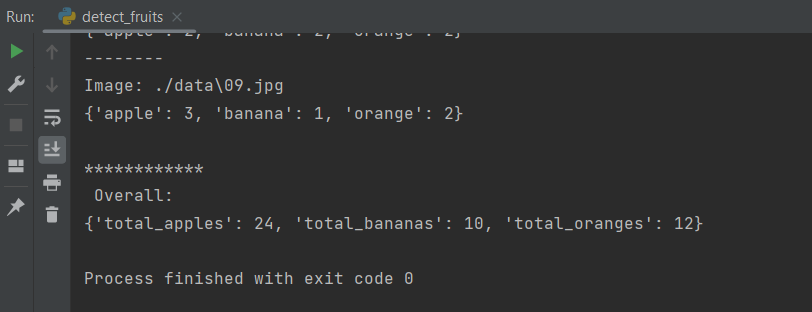

# Fruits
Python script which identifies and counts fruits (oranges, bananas, apples) from image based on their HSV values.
You can find images that I have been working with in the /data folder.
Results are printed after running the code.

Correct final result:

  

